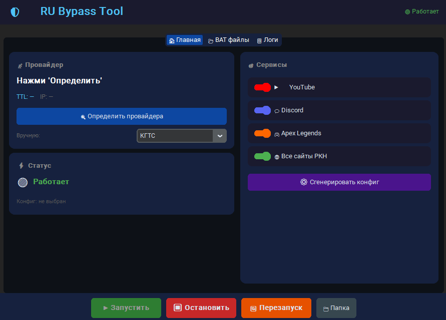

# Zapret-RU-Bypass-Tool
Интерфейс для zapret-discord-youtube

Графический интерфейс для zapret-discord-youtube

⚠️ Статус проекта: Alpha

## Особенности

- Простой запуск zapret
- Настройка каждой стратегии
- Запуск стратегии как вам удобно (астоматически со стартом системы или в ручную)
- Проверка работоспособности каждой стратегии
- Базовая конфигурация обхода DPI

## Текущее состояние:

В настоящее время проект находится в разработке.

Что работает на данный момент:
- Основной интерфейс
- Запуск/остановка стратегий
- Базовые настройки

В разработке / Работает нестабильно:
- Отображение запущенной стратегии на главном экране
- Расширенная маршрутизация
- Определение провайдера
- Авто генерация стратегии под определённого провайдера
- Автообновление 

## Screenshots

## Установка

1. Скачайте последний релиз
2. Поместите RU_Bypass_Tool в папку с вашим Zapret
3. В папке RU_Bypass_Tool, запустите приложение RU_Bypass_Tool.exe

## Gредупреждение

Это программное обеспечение находится на стадии альфа-тестирования.
Некоторые функции могут работать некорректно.

## Roadmap

- [ ] Стабильная система настройки
- [ ] Полная интеграция zapret с выбором нужной вам версии
- [ ] Автообновление
- [ ] 

## License

MIT
